<!-- ----------------------------------------------------------------------- Main README ----------------------------------------------------------------------------->

<!-- Text header -->   
<!-- OLD: "https://capsule-render.vercel.app/api?type=transparent&color=c4ffff&height=150&section=header&text=Hi%20🌎,%20I'm%20an%20Eye%20&fontSize=79&animation=fadeIn&fontAlignY=38&desc=An%20eye%20high%20on%20caffeine%20having%20fun%20with%20programming&descAlignY=75&descAlign=50&descSize=22" -->

    <a href="https://github.com/TheBigEye#gh-light-mode-only">
        <!-- light mode -->
        
    </a>
    <a href="https://github.com/TheBigEye#gh-dark-mode-only">
        <!-- dark mode -->
        
    </a>

<!-- Views -->

 
     

<!-- Light or dark according to the github theme that the user has when viewing it -->

 <!-- light mode -->

 <!-- Dark mode -->

<!-- ----------------------------------------------------------------------------------------------------------------------------------------------------------------->
- 🔭 I’m currently working on **[Aircraft](https://github.com/TheBigEye/Aircraft)** and **[Python OS](https://github.com/TheBigEye/Python-OS)**.

- 🌱 I’m currently learning **[Python](https://github.com/topics/python)**, **[Java](https://github.com/topics/java)**, **[C/C++](https://github.com/topics/cpp)**, **[OS](https://github.com/topics/operating-system)** and **[Games](https://github.com/topics/game-engine)** development.

- 👯 I’m currently collaborating on **[Minicraft +](https://github.com/MinicraftPlus/minicraft-plus-revived)**.

- ⚡ Fun fact, 
<a href="https://github.com/TheBigEye#gh-light-mode-only">  <!-- light mode -->
**This looks better in dark mode**. 
</a> 
<a href="https://github.com/TheBigEye#gh-dark-mode-only">  <!-- Dark mode -->
**This looks better in light mode**.
</a> 

- 🎨 Favorite color **Green**.

<!-- ----------------------------------------------------------------------------------------------------------------------------------------------------------------->

<!-- User stats -->

     <a href="https://github.com/TheBigEye#gh-light-mode-only">
          <!-- Light mode -->
          
     </a>
     <a href="https://github.com/TheBigEye#gh-dark-mode-only">
          <!-- Dark mode -->
          
     </a>

<!-- ----------------------------------------------------------------------------------------------------------------------------------------------------------------->

<!-- Top langs used -->

    <a href="https://github.com/TheBigEye#gh-light-mode-only">
        <!-- Light mode -->
        
    </a>
    <a href="https://github.com/TheBigEye#gh-dark-mode-only">
        <!-- Dark mode -->
        
    </a>

<!-- ----------------------------------------------------------------------------------------------------------------------------------------------------------------->

<!-- Contributions -->
<a href="https://github.com/TheBigEye#gh-light-mode-only">
     <!-- Light mode -->
     
</a>
<a href="https://github.com/TheBigEye#gh-dark-mode-only">
     <!-- Dark mode -->
     
</a>

<!-- -------------------------------------------------------------------------- Credits ------------------------------------------------------------------------------>
<!-- Header and footer svgs --- kyechan99/capsule-render -->
<!-- Views counter --- antonkomarev/github-profile-views-counter -->
<!-- ---------------------------------------------------------------------------- END -------------------------------------------------------------------------------->

