<!-- ------ README --------->

<!-- Header -->   

   <!-- light mode -->
   <!-- dark mode -->

<!-- Views -->

 
     

   <!-- light mode -->
   <!-- dark mode -->

<!-- ----------------------------------------------------------------------------------------------------------------------------------------------------------------->
- 🔭 I’m currently working on **[Aircraft](https://github.com/TheBigEye/Aircraft)** and **[Python OS](https://github.com/TheBigEye/Python-OS)**.
- 🌱 I’m currently learning **[Python](https://github.com/topics/python)**, **[Java](https://github.com/topics/java)**, **[C/C++](https://github.com/topics/cpp)**, **[OS](https://github.com/topics/operating-system)** and **[Games](https://github.com/topics/game-engine)** development.
- 👯 I’m currently collaborating on **[Minicraft+](https://github.com/MinicraftPlus/minicraft-plus-revived)**.
- ⚡ Fun fact, **[Assembly Language](https://github.com/topics/assembly-language)** is easy to write, hard to learn.
- 🎨 **Green** is my favorite color.

<!-- ----------------------------------------------------------------------------------------------------------------------------------------------------------------->

<!-- User stats -->

     <a href="https://github.com/TheBigEye#gh-light-mode-only">
          <!-- Light mode -->
          
     </a>
     <a href="https://github.com/TheBigEye#gh-dark-mode-only">
          <!-- Dark mode -->
          
     </a>

<!-- ----------------------------------------------------------------------------------------------------------------------------------------------------------------->

<!-- Top langs used -->

    <a href="https://github.com/TheBigEye#gh-light-mode-only">
        <!-- Light mode -->
        
    </a>
    <a href="https://github.com/TheBigEye#gh-dark-mode-only">
        <!-- Dark mode -->
        
    </a>

<!-- ----------------------------------------------------------------------------------------------------------------------------------------------------------------->

<!-- Contributions -->
<a href="https://github.com/TheBigEye#gh-light-mode-only">
     <!-- Light mode -->
     
</a>
<a href="https://github.com/TheBigEye#gh-dark-mode-only">
     <!-- Dark mode -->
     
</a>

<!-- -------------------------------------------------------------------------- Credits ------------------------------------------------------------------------------>
<!-- Header and footer svgs --- kyechan99/capsule-render -->
<!-- Views counter --- antonkomarev/github-profile-views-counter -->
<!-- ---------------------------------------------------------------------------- END -------------------------------------------------------------------------------->
